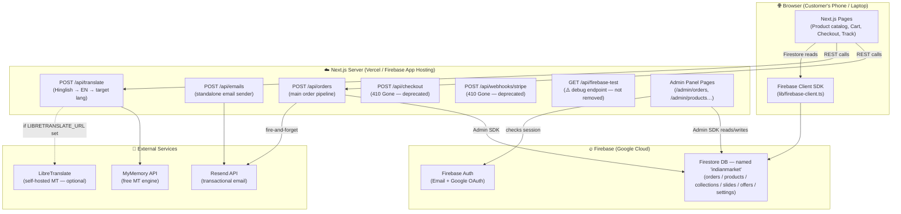
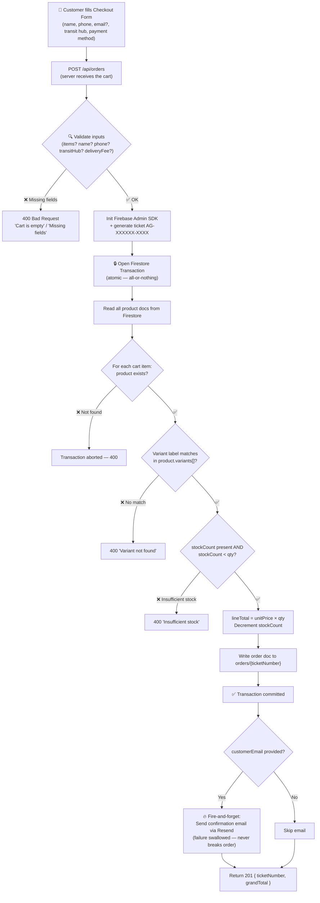
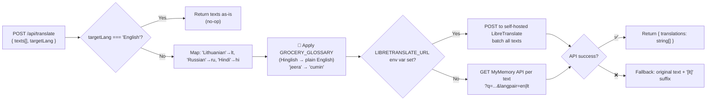
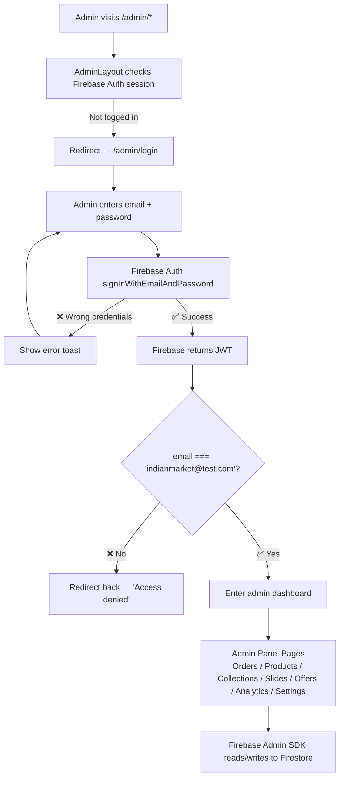
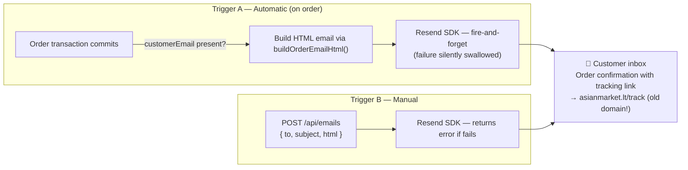
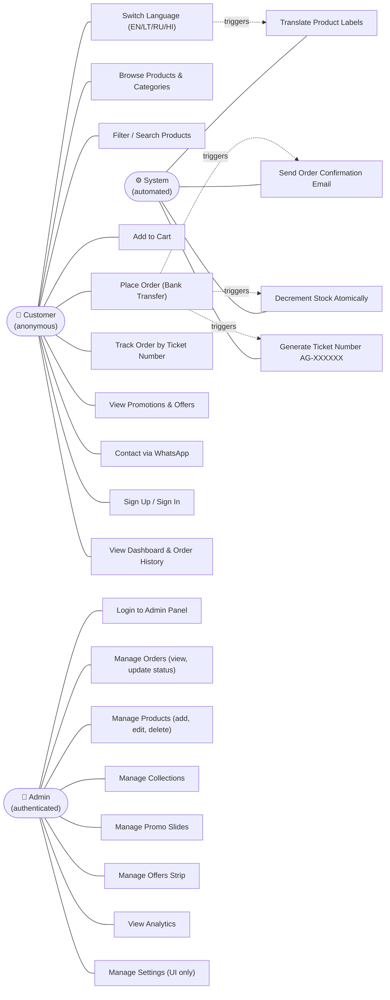
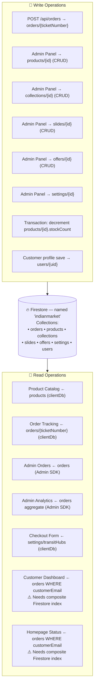

# 🛒 Asian Groceries — Complete System Diagrams

> Merged from two analysis sessions. All diagrams reflect the actual codebase of `e-commerce-app-design`.
> Each diagram has a plain-English **Analogy** and a **What's Missing** section.

---

# PART 1 — Architecture & App State Overview

---

## 📐 Diagram 1 — Current State (What's Built)

> *"The full shop floor map — every room and every machine"*

```mermaid
flowchart TD
    subgraph CUSTOMER["🛍️ Customer-Facing App (Next.js)"]
        direction TB
        HOME["🏠 Homepage\n• Promo Slider\n• Offers Strip\n• Category Bar\n• Product Carousel\n• WhatsApp Section"]
        CATALOG["🔍 Product Catalog\n• Search + Filters\n• Origin / Diet / Stock filters\n• Category Groups\n• Product Cards (variants)"]
        CART["🛒 Cart (Sheet)\n• LocalStorage persistence\n• Quantity controls\n• Weight + subtotal calc"]
        CHECKOUT["💳 Checkout Form\n• 3-step wizard\n• Bus courier destinations\n• Payment method selector\n• Bank transfer / Cash"]
        AUTH["🔐 Auth Page\n• Email + Password sign-up/in\n• Google OAuth\n• Firebase Auth"]
        TRACK["🚌 Track Order\n• /track?ticket=\n• BusTracker component"]
        COMMUNITY["💬 Community\n• WhatsApp group link\n• QR code\n• WhatsApp section"]
        DASHBOARD["👤 Customer Dashboard\n• Order history\n• Profile / settings\n• Active order status"]
    end

    subgraph ADMIN["🔧 Admin Portal (/admin — owner-only)"]
        direction TB
        ADM_DASH["📊 Dashboard\n• KPI cards (turnover, orders)\n• Recent orders table\n• Status update dropdowns\n• Low stock alerts"]
        ADM_ORDERS["📦 Orders\n• Full Firestore order list\n• Status management"]
        ADM_PRODUCTS["📋 Products\n• Add / Edit / Delete\n• Variants, stock, images"]
        ADM_COLLECTIONS["📂 Collections\n• Featured collection groups"]
        ADM_SLIDES["🖼️ Slides\n• Promo slider management\n• Hero slides CRUD"]
        ADM_OFFERS["🏷️ Offers\n• Offers strip management\n• Badges + dates"]
        ADM_ANALYTICS["📈 Analytics\n• Revenue, orders, stock\n• Live Firestore metrics"]
        ADM_SETTINGS["⚙️ Settings\n• Store info (UI only)\n• Notification toggles (UI only)"]
    end

    subgraph API["⚡ API Routes (Next.js Server)"]
        API_ORDERS["POST /api/orders\n• Price recalc server-side\n• Ticket # generation\n• Firestore write\n• Resend email confirmation"]
        API_EMAILS["POST /api/emails\n• Standalone email endpoint"]
        API_ADMIN["POST /api/admin\n• Admin server actions"]
        API_TRANSLATE["POST /api/translate\n• i18n support\n• Hinglish glossary\n• MyMemory / LibreTranslate"]
        API_FBTEST["GET /api/firebase-test\n• ⚠️ Debug endpoint — NOT removed"]
        API_CHECKOUT["POST /api/checkout\n• 410 Gone — deprecated stub"]
        API_STRIPE["POST /api/webhooks/stripe\n• 410 Gone — deprecated stub"]
    end

    subgraph FIREBASE["🔥 Firebase Backend"]
        FS_ORDERS[("Firestore\n'orders' collection")]
        FS_PRODUCTS[("Firestore\n'products' collection")]
        FS_SLIDES[("Firestore\n'slides' collection")]
        FS_OFFERS[("Firestore\n'offers' collection")]
        FS_COLLECTIONS[("Firestore\n'collections' collection")]
        FS_SETTINGS[("Firestore\n'settings' collection")]
        FB_AUTH[("Firebase Auth\nEmail + Google")]
    end

    subgraph EXTERNAL["🌐 External Services"]
        RESEND["📧 Resend\nEmail confirmations\nto customers"]
        WHATSAPP["💬 WhatsApp\n+37061676111\nGroup community"]
        MYMEMORY["🌐 MyMemory API\nFree translation engine"]
        LIBRETRANSLATE["🔧 LibreTranslate\nOptional self-hosted MT"]
    end

    HOME --> CATALOG
    CATALOG --> CART
    CART --> CHECKOUT
    CHECKOUT --> API_ORDERS
    AUTH --> FB_AUTH
    TRACK --> FS_ORDERS
    DASHBOARD --> FS_ORDERS
    ADM_DASH --> FS_ORDERS
    ADM_ORDERS --> FS_ORDERS
    ADM_PRODUCTS --> FS_PRODUCTS
    ADM_SLIDES --> FS_SLIDES
    ADM_OFFERS --> FS_OFFERS
    ADM_COLLECTIONS --> FS_COLLECTIONS
    ADM_ANALYTICS --> FS_ORDERS
    API_ORDERS --> FS_ORDERS
    API_ORDERS --> FS_PRODUCTS
    API_ORDERS --> RESEND
    API_TRANSLATE --> MYMEMORY
    API_TRANSLATE -.->|"if env var set"| LIBRETRANSLATE
    ADMIN -. "owner-only guard\n(email whitelist)" .-> FB_AUTH

    style CUSTOMER fill:#0f2027,stroke:#F97316,color:#fff
    style ADMIN fill:#0d1117,stroke:#6366f1,color:#fff
    style API fill:#0a1628,stroke:#22c55e,color:#fff
    style FIREBASE fill:#1a1200,stroke:#f59e0b,color:#fff
    style EXTERNAL fill:#0c1a0c,stroke:#25D366,color:#fff
```

**🪣 Analogy:** Imagine a **physical Asian grocery store in a shopping mall**:
- The **customer floor** is the public shopping area — aisles, products, checkout counter, parcel tracking board.
- The **admin back room** is the staff-only office — only the owner can enter, using a hardcoded keycard (one email address).
- The **API routes** are the store's internal machines — the order processor, the receipt printer, the translator, and two broken machines (Stripe/checkout stubs) left in the corner with "OUT OF ORDER" signs.
- **Firebase** is the filing room — all records live here under the name `'indianmarket'` (even though the store is called "Asian Groceries").
- **External services** are third-party suppliers — the post office (Resend), the translator (MyMemory).

---

## 🚧 Diagram 2 — What's Left / Not Yet Built

> *"The empty rooms and broken machines"*

```mermaid
flowchart TD
    subgraph MISSING_PAYMENT["💳 Payment Integration (Not Built)"]
        STRIPE["❌ Stripe / Online Payment\n• No card payments yet\n• Stripe webhook returns 410 Gone\n• Only bank transfer + cash work"]
    end

    subgraph MISSING_SETTINGS["⚙️ Settings (UI Only — Not Wired)"]
        SETTINGS_SAVE["❌ Settings persistence\n• Store name/email/phone are\n  hardcoded — save button is fake\n• No Firestore write on save\n• Notification toggles do nothing"]
    end

    subgraph MISSING_ADMIN["🔧 Admin — Incomplete Features"]
        ANALYTICS_CHARTS["❌ Analytics Charts\n• Only stat cards exist\n• No time-series graphs\n• No revenue trend charts\n• No best-sellers ranking"]
        USERS_PAGE["❌ Users / Customers page\n• No customer list in admin\n• No customer profiles view"]
        EXPORT["❌ Data Export\n• No CSV/PDF export\n• No bulk invoice download"]
    end

    subgraph MISSING_TRACK["🚌 Order Tracking (Partial)"]
        TRACK_DETAIL["⚠️ Bus Tracker\n• BusTracker component exists\n• But no real courier API\n• Status is manually updated by admin"]
        PUSH_NOTIF["❌ Push Notifications\n• No SMS / push alerts\n• Customer must poll /track"]
    end

    subgraph MISSING_CATALOG["🛍️ Catalog — Missing Features"]
        SEARCH_ADV["❌ Full-text search\n• No Algolia / server-side search\n• Only client-side filter works"]
        REVIEWS["❌ Product Reviews\n• No review system\n• No star ratings"]
        WISHLIST["❌ Wishlist / Favourites\n• No save-for-later"]
        STOCK_REAL["⚠️ Stock reservation\n• No reservation between\n  add-to-cart and checkout"]
    end

    subgraph MISSING_AUTH["🔐 Auth — Gaps"]
        FORGOT_PW["❌ Forgot Password\n• No reset email flow"]
        EMAIL_VERIFY["❌ Email Verification\n• New accounts not verified"]
        PHONE_AUTH["❌ Phone OTP auth\n• Only email + Google OAuth active"]
    end

    subgraph MISSING_I18N["🌍 i18n (Partial)"]
        TRANSLATE["⚠️ Translation\n• API exists but UI not fully translated\n• Hindi target but source is always English"]
    end

    subgraph MISSING_SEO["🔍 SEO / Performance"]
        OG_META["❌ OG meta tags / JSON-LD / sitemap.xml"]
        PERF["⚠️ No Firebase Storage / CDN for images"]
    end

    MISSING_PAYMENT --- MISSING_SETTINGS
    MISSING_SETTINGS --- MISSING_ADMIN
    MISSING_ADMIN --- MISSING_TRACK
    MISSING_TRACK --- MISSING_CATALOG
    MISSING_CATALOG --- MISSING_AUTH
    MISSING_AUTH --- MISSING_I18N
    MISSING_I18N --- MISSING_SEO

    style MISSING_PAYMENT fill:#2a0000,stroke:#ef4444,color:#fff
    style MISSING_SETTINGS fill:#1a1200,stroke:#f59e0b,color:#fff
    style MISSING_ADMIN fill:#0d0020,stroke:#a855f7,color:#fff
    style MISSING_TRACK fill:#001a10,stroke:#22c55e,color:#fff
    style MISSING_CATALOG fill:#001020,stroke:#3b82f6,color:#fff
    style MISSING_AUTH fill:#1a0010,stroke:#ec4899,color:#fff
    style MISSING_I18N fill:#0a1020,stroke:#06b6d4,color:#fff
    style MISSING_SEO fill:#101010,stroke:#6b7280,color:#fff
```

**🪣 Analogy:** These are the **rooms on the blueprint that haven't been furnished**:
- The payment room has a design but the cash machine (Stripe) was never installed.
- The settings panel is a beautiful but **fake control room** — flipping switches does nothing.
- The analytics office only has **scorecards on the wall** — no charts, no trend screen.
- The order tracking board is **manually updated** by the owner — no live courier feed.

---

## 📋 Summary Status Table

| Area | Status |
|---|---|
| Storefront (Home, Catalog, Cart) | ✅ Done |
| Checkout (Bank Transfer + Cash) | ✅ Done |
| Firebase Auth (Email + Google OAuth) | ✅ Done |
| Admin Portal (CRUD + Orders) | ✅ Done |
| Order confirmation emails (Resend) | ✅ Done |
| Invoice PDF generator | ✅ Done |
| Translation / i18n (EN→LT/RU) | ⚠️ Partial |
| Bus courier tracking (manual status) | ⚠️ Partial |
| Analytics (stat cards only) | ⚠️ Partial |
| Online payment (Stripe / card) | ❌ Missing |
| Stock reservation (cart → checkout) | ❌ Missing |
| Settings persistence to Firestore | ❌ Missing |
| Product reviews + ratings | ❌ Missing |
| Push / SMS notifications | ❌ Missing |
| SEO / OG tags / sitemap | ❌ Missing |
| Customer list in admin | ❌ Missing |
| Forgot password / email verify | ❌ Missing |
| Full-text product search | ❌ Missing |
| Wishlist / save for later | ❌ Missing |

---
---

# PART 2 — Detailed Pipeline Diagrams

---

## 1. 🏗️ System Architecture (Detailed)

> *"Every wire in the building"*

**🪣 Analogy:** Think of the system as a **physical grocery store building**:
- The **Browser** is the customer walking the aisles.
- **Next.js Server** is the cashier counter + back office.
- **Firebase** is the store's filing cabinet + security guard.
- **Resend** is the post office that mails your receipt.
- **MyMemory** is the multilingual shop assistant who translates the spice names.

---

## 2. 📦 Order Placement Pipeline

> *"From Cart to Confirmed"*

**🪣 Analogy:** Like a **supermarket self-checkout kiosk**:
1. You scan items (validate inputs).
2. The kiosk locks the drawer (Firestore transaction — atomic).
3. Checks every barcode, every size, enough stock.
4. If wrong → whole sale cancelled.
5. If good → records sale, reduces stock, prints receipt.
6. Tries to email the receipt — if the post office is closed, purchase is still complete.

**❌ What's Missing:**
- No payment verification — bank transfer is confirmed manually.
- No stock reservation between add-to-cart and checkout.
- `totalWeight` hardcoded to `0` — weight-based delivery not implemented.
- Order writes `grandTotal` but many components read `amountTotal` — **field name mismatch**.

---

## 3. 🌐 Translation Pipeline

> *"The Multilingual Spice Label Machine"*

**🪣 Analogy:** A **3-step translator at the market**:
1. Already in the right language? Done.
2. Decode local slang ("jeera" → "cumin") before calling translator.
3. Call free online translator (MyMemory) or self-hosted (LibreTranslate).
4. If unavailable → show original word, never crash.

**❌ What's Missing:**
- No caching — same word translated fresh every page load.
- Hindi target but source is always English — Hindi-labelled products won't translate correctly.
- No RTL language support (Arabic, Urdu).
- MyMemory daily quota — no rate-limit handling.

---

## 4. 🔐 Admin Authentication Pipeline

> *"The Staff Entrance With a Hardcoded Keycard"*

**🪣 Analogy:** The admin door has a keycard reader — but only **one specific card** is hardcoded to work. Even if another Firebase user exists, they can't get in.

**❌ What's Missing:**
- Admin email `'indianmarket@test.com'` is **hardcoded as a literal string in 4+ files** — one typo or email change breaks all admin access.
- No role-based access — no manager vs. staff hierarchy.
- No MFA, no session timeout, no audit log.

---

## 5. 📧 Email Pipeline

> *"The Receipt Printer"*

**🪣 Analogy:** Two ways to print a receipt — automatic on order confirmation, or manually from the back office.

**❌ What's Missing:**
- No status-update emails ("Your order is packed", "Out for delivery").
- No admin notification email on new order.
- Sender is `onboarding@resend.dev` — not production-ready.
- Tracking link points to `asianmarket.lt` — **potentially the wrong/old domain**.

---

## 6. 🗺️ Use Case Diagram

> *"Who can do what in the store"*

**🪣 Analogy:** A shopping mall with two entrances — public front door and a staff keycard entrance. Automated systems (air conditioning equivalent) run silently in the background.

**❌ Missing Use Cases:**

| Missing Use Case | Analogy |
|---|---|
| Wishlist / Save for Later | "No wish-list clipboard at the entrance" |
| Product Reviews & Ratings | "No feedback box in the store" |
| Order Cancellation by Customer | "Can't cancel at the counter" |
| Admin sends status-update email | "Staff can't text you when parcel is ready" |
| Automated low-stock alert | "No blinking red light on empty shelves" |
| Payment confirmation webhook | "Cashier manually confirms bank transfers" |
| Returns / Refunds pipeline | "No returns desk" |
| Push / SMS notifications | "No loudspeaker to call your order number" |
| Role-based admin access | "All staff have master keys" |
| Forgot Password flow | "No lost-key recovery" |
| Email verification on sign-up | "Anyone can claim any email" |

---

## 7. 🗄️ Firestore Data Pipeline

> *"How data flows in and out of the filing cabinet"*

**🪣 Analogy:** Firestore is the **store's master filing cabinet** with two sets of keys — a customer key (Client SDK, read-limited) and the manager's master key (Admin SDK, full access).

**❌ What's Missing:**
- `firestore.indexes.json` is **empty** — `WHERE customerEmail + ORDER BY createdAt` queries need a composite index or they will **fail in production**.
- Orders secured by unguessable ticket ID only — no user-identity-based security.
- `users` collection rule exists but nothing in the order flow writes to it.
- No subcollections — items are flat arrays, limiting scalability.

---

*Merged system diagrams — `e-commerce-app-design` — Asian Groceries project.*
